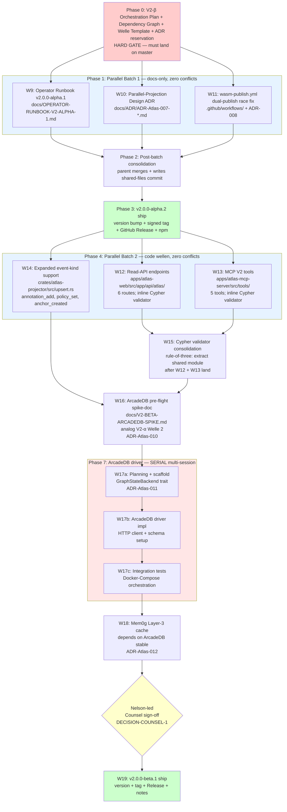

# V2-β Welle Dependency Graph

> **Status:** Phase-0 output, master-resident. **Effective 2026-05-13.** Companion to [`V2-BETA-ORCHESTRATION-PLAN.md`](V2-BETA-ORCHESTRATION-PLAN.md).
> **Purpose:** explicit dependency edges between V2-β wellen so that parallel-batch identification + serial-chain ordering is unambiguous.

## 1. Mermaid dependency diagram



## 2. Dependency edges (textual form)

```
Phase 0 (hard gate) → W9, W10, W11

W9, W10, W11 → Phase 2 (consolidation) → Phase 3 (alpha.2 ship)

Phase 3 → W12, W13, W14

W12, W13 → W15 (Cypher consolidation, rule-of-three)
W14, W15 → W16

W16 (spike) → W17a → W17b → W17c → W18

W18 → Counsel-Gate (Nelson-led) → W19 (beta.1 ship)
```

## 3. File-area conflict matrix

### Phase 1 (Parallel Batch 1)

| Welle | Touches | Conflicts with |
|---|---|---|
| W9 | `docs/OPERATOR-RUNBOOK-V2-ALPHA-1.md` (NEW) | None |
| W10 | `docs/ADR/ADR-Atlas-007-*.md` (NEW) | None |
| W11 | `.github/workflows/wasm-publish.yml` + `docs/ADR/ADR-Atlas-008-*.md` | None |

**Anti-divergence enforcement:** None of W9/W10/W11 touch `CHANGELOG.md`, `docs/V2-MASTER-PLAN.md`, `.handoff/decisions.md`, `docs/SEMVER-AUDIT-V1.0.md`, or `.handoff/v2-session-handoff.md` — parent's consolidation commit does these.

### Phase 4 (Parallel Batch 2)

| Welle | Touches | Conflicts with |
|---|---|---|
| W12 | `apps/atlas-web/src/app/api/atlas/{entities,related,timeline,query,audit,passport}/route.ts` (NEW per route) | None at this level |
| W13 | `apps/atlas-mcp-server/src/tools/{query-graph,query-entities,query-provenance,get-agent-passport,get-timeline}.ts` (NEW) + `src/tools/index.ts` (modify to register) + `src/tools/types.ts` (extend) | Potentially `index.ts` shape conflicts — but only one welle touches it |
| W14 | `crates/atlas-projector/src/upsert.rs` (extend) + new tests | None at this level (welles 12+13 don't touch Rust) |

**Subtle Phase-4 risk:** W13 touches `apps/atlas-mcp-server/src/tools/index.ts` (registration site). W12 does NOT touch index.ts. Zero conflict between W12/W13/W14 at file level.

### Phase 5+ (Serial)

W15 through W19 are serial — each welle is one PR at a time. No parallel-conflict analysis needed.

## 4. ADR-number assignment (pre-allocated to prevent number-races)

| ADR # | Welle | Topic |
|---|---|---|
| 007 | W10 | Parallel-projection design |
| 008 | W11 | wasm-publish.yml race postmortem |
| 009 | W15 | Cypher-validator consolidation rationale |
| 010 | W16 | ArcadeDB backend choice + embedded-mode trade-off |
| 011 | W17a | ArcadeDB driver scaffold + trait design |
| 012 | W18 | Mem0g cache invariants |
| 013-017 | (reserved for V2-γ/V2-δ) | future |

Existing ADR high-watermark: `ADR-Atlas-006-multi-issuer-sigstore-tracking.md`. V2-β starts at 007.

## 5. Critical-path analysis

**Longest serial path:** Phase 0 → W14 → W16 → W17a → W17b → W17c → W18 → Counsel-Gate → W19. **9 nodes.** Parallel batches don't shorten this path; they only reduce the wall-clock duration of phases 1 + 4.

**Theoretical wall-clock (Atlas's 1-welle-per-session cadence):**

| Path | Sessions (sequential) | Sessions (with parallel) |
|---|---|---|
| Phase 0 | 1 | 1 |
| Phase 1 (W9+W10+W11) | 3 | 1 (3 parallel subagents) |
| Phase 2 (consolidation) | 1 | 1 |
| Phase 3 (alpha.2 ship) | 1 | 1 |
| Phase 4 (W12+W13+W14) | 3 | 1 (3 parallel subagents) |
| Phase 5 (W15 consolidation) | 1 | 1 |
| Phase 6 (W16 spike) | 1 | 1 |
| Phase 7 (W17a + W17b + W17c) | 3 | 3 (serial, can't parallelise) |
| Phase 8 (W18 Mem0g) | 1 | 1 |
| Phase 9 (W19 beta.1 ship) | 1 | 1 |
| **Total** | **16 sessions** | **12 sessions** |

Parallel dispatch saves ~25% wall-clock. Counsel-track runs in parallel with engineering but gates the final ship.

## 6. Rollback / re-plan triggers

If any of these conditions arise mid-execution, halt parallel dispatch and re-plan Phase 0 deliverables:

- **Per-welle byte-determinism CI pin breaks** after merge → blocked downstream work; root-cause first
- **Cross-welle consistency-reviewer surfaces a CRITICAL after parallel-batch ends** → consolidation commit refused; re-dispatch affected welle
- **ArcadeDB spike (W16) recommends NOT proceeding** → V2-β scope re-shaped; W17 becomes "alternative DB backend" or remains in-memory-only for beta.1
- **Counsel sign-off blocks at any V2-β-α.2 or beta.1 ship gate** → parallel-track Nelson-led work; engineering-pipeline pauses on the affected scope

---

## What this graph deliberately does NOT include

- **V2-γ welle dependencies** (Agent Passports, Regulator-Witness Federation, Hermes-skill v1) — separate planning phase post-V2-β
- **V2-δ welle dependencies** (Cedar policy at write-time, post-quantum hybrid co-sign) — V2-δ planning phase
- **Implementation-detail inter-file dependencies within a welle** — those are scoped in each welle's own plan-doc per the template in `.handoff/v2-beta-welle-N-plan.md.template`
- **Counsel-track sub-tasks** — Nelson-led parallel work; not engineering-pipeline dispatchable
